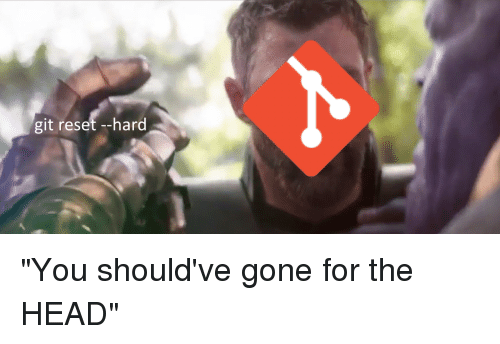

### A Guide To Undoing Git Mistakes ✅️👨🏻‍🏭


**Mistakes!** These are not required for software development. However,
they always manage to spoil the beauty of software creation. 🙀

As a result, mistakes are unavoidable. How can you get over your
mistakes?

The ability to undo is a useful feature of a Version Control System.\
Git is a wonderful safety net that will offer you another chance if you
make a bad decision. 😎

Want to go through some useful Git commands? This could be valuable to
you.

[**Git commands you must unquestionably know! 🚀**\
*The most widely used distributed version control system worldwide is
called Git. This programme was developed back
in...*devangtomar.medium.com](https://devangtomar.medium.com/git-commands-you-must-unquestionably-know-69aeb8594bd3)

In this article, I've described the types of mistakes you can make and
the Git approaches that will help you untangle yourself from them.

#### 1. Delete Untracked Files ☠️

You added some new files to your project and updated a few others.
You've changed your mind and decided that you don't need any of the new
files you've created and will stick with the modified file changes.


Git has a command for removing untracked files :

```git clean -f```

The git clean command requires the -f parameter, which denotes the force
directive (also  --- force). Because this operation involves deleting
untracked files, you must be certain of what you are doing because
removing uncommitted work in Git is impossible.

This command will not remove untracked folders or files defined
by .gitignore file by default. To have ignored files removed, use the -x
option.

Additionally, git clean does not execute recursively on directories.
This is yet more safeguard against unintentional permanent erasure.

Use the -d switch to remove directories as well.

```git clean -df```

This will remove untracked files and directories but not those listed in
the .gitignore file.

#### 2. Stop tracking a tracked file ⛔

You have a node modules folder that you don't want git to track.\
You committed the node modules folder, but you failed to ignore it using
a .gitignore file. You create the.gitignore file and include the node
modules folder in it before committing.


However, Git is still tracking it (node modules). This is due to the
fact that once a file has been created and committed to the Git
database, Git will continue to track changes to it.

You want Git to cease tracking the node modules subdirectory.

Just run:

```git rm -r \--cached node_modules```

#### 3. Modify the Last Commit 🔨

You've made a commit to your local Git Database. After that, you realise
you neglected to add file modifications in that commit (you may have not
saved the file). Or you add a new file and want it to be linked to the
most recent commit you made.


Git will allow you to add your new file after unlocking the prior
commit.

Simply follow these steps:

To begin, add the missing file with :

```git add newfile.ts```

Then, run:

```git commit \--amend \--no-edit```

The \--no-edit flag amends the commit without changing the commit
message.

#### 4. Discarding all Changes in your working directory 🗑️

You're hard at work on your project. For instance, you could be
reworking your code to adhere to better patterns and clean code
standards. You break a functionality in the program when refactoring and
can't figure out what went wrong. You wish to return to the previous
state (commit) where the application was working properly so that you
can regain your bearings.


So you want to undo all of your uncommitted changes and return your Git
working tree to the state it was in when the last commit occurred.

Use the command:

```git restore .```

_Note: This command restores your working copy to the most recent commit
in your local git database. Changes that you have not committed will be
lost permanently._

#### 5. Discard all changes made to a file 🚮

You have made changes to the files in your local git repo. You
subsequently discover that the changes you made to a specific file
(connect.js) were not very intelligent and should be undone. However,
you want to keep any changes made to other files.


So you want the file connect.js to be restored to its previous state.

Git allows you to do this :

```git restore index.js```

#### 6. Modify the Last Commit Message 🏭

This is a scenario similar to the one described above. But this time,
you've committed to git, and you're not thrilled with the commit message
you chose. You want the message to be more meaningful in describing what
you did.


Git is once again forgiving, allowing you to fix your previous crappy
commit message.

Simply put, run :

```git commit \--amend -m \"Phew! A better commit message this time\"```

#### 7. Restore a file to an old version back in time ⌛

Unlike the previous command, you want a specific file in your project to
be restored to a state that is further back in time than the previous
commit.

So, if version 3 was your previous commit, you want this particular file
to appear as it did in version 2, which was prior to version 3.


Using Git:

Find and copy the commit hash whenever you want :

```git log```

Then:

```git restore \--source \<commit-hash\> \<filename\>```

That simple, right?

#### 8. Recover a deleted file(previously committed) ♻️

You are making changes to your project when you notice an outdated file.
You proceed to delete the file in order to free up space. You later
realise you require the file you just deleted.

To get your file back :

```git restore deleted-file.css```

This will present the file to you as it was in the previous commit.

#### 9. Discard all changes in your local repo to exact state in remote 🎒

You made a few changes and commits to your local repo branch. You've
rewired, and you're wondering, "Why did I even make these changes in the
first place?"




So you want to delete everything on your current local branch and
replace it with the remote's main branch.

Simply undo as follows :

```git reset \--hard origin/main```

_WARNING: Uncommitted changes will be lost permanently._

**10. Switch a commit to a different branch 🔼🔽**

You are currently working on two features for the project: creating a
newsletter and fine-tuning the footer layout. You've established two
distinct branches: newsletter and footer-layout, each with its own
feature: newsletter and footer-layout, respectively.

You are presently adding the newsletter functionality and committing to
the newsletter branch. When you return to your project, you want to work
on the footer-layout feature but neglect to switch to the footer-layout
branch. You commit the footer-layout feature from the incorrect
newsletter branch.

Later, you discover that the commit you made to the newsletter branch
actually belongs to the footer-branch.


So you want the commit that adds the footer-layout feature to be moved
from the newsletter branch to the footer-layout branch.

In Git, do the following :

Check out the newsletter section :

git checkout newsletter

Find and copy the _commit hash_ of the commit that added the
_footer-layout feature_. Run the command:

git log

Checkout the rightful branch you want to apply with this commit. In our
case:

git checkout footer-layout

Then apply the commit:

git cherry-pick \<commit-hash\>

Then checkout the newsletter branch:

git checkout newsletter

And strip it off this unwanted commit, which is the commit that adds the
_footer-layout_:

git reset HEAD\~1 \--hard

HEAD\~1 indicates that we are resetting our newsletter branch to one
commit behind the most recent commit and removing the commit from which
we have moved away. Remember that the most recent commit on this
newsletter branch was the one with the footer-layout feature.

#### 11. Resurrect a deleted branch 🔙

You decide you no longer require a feature branch and swing the garbage
can over it (delete it). The next time you are alarmed, delete it by
accident. You are now in "panic mode." You wish you could go back in
time and get it back.


So you'd like to recover your deleted branch.

Here's how to recover your deleted branch:

Locate and copy the commit hash of your deleted branch, which will be
displayed when you run the command :

git reflog

Then recreate your branch as:

git branch \<branch-name\> \<deleted-branch-commit-hash\>

This will establish a branch with all of the work up to the
deleted-branch-commit-hash\>. If deleted-branch-commit-hash\> is not the
most recent work in the deleted branch, you can still find new commit
hashes until you find one that contains your most recent work. When you
type git branch, your previously deleted branch will be listed again.
This works even if the branch in origin was deleted (remote).

If the branch-name\> isn't what you're looking for, simply rename it
with git branch -m branch-name\> new-branch-name\>.

Needless to say, the key to successfully restoring your deleted branch
is locating the correct commit hash, so name your commits wisely; it
will help a lot.

#### 12. Rewind/undo an erroneous commit ⏪

A new version of a project has been released by your team. You're all
convinced that the new features are a work of art. Just seconds later,
an urgent call from the team leader states that the newly released
version contains a significant fault that must be addressed immediately.
The technical team must respond quickly, and sitting down to uncover the
issue is not an appropriate solution to an urgent situation.


Undoing the changes to the error-prone release is one of the quickest
responses.

So you want to roll back the changes made to a commit.

This is how you do it in Git:

Find and copy the commit hash of the commit from which you wish to undo
changes (the broken commit).

git log

Revert changes specified by that commit:

git revert \<broken-commit-hash\>

#### 13. Undo a Git Merge 👈🏻❌

You are pleased with the new improvements in the feature branch. You
believe you are ready to merge the feature branch into your main branch.
So you merge feature branch from your main branch and push your new
modifications to the remote repository.


Moments later, you understand that merge was not at all a nice move.

So you want to reverse the merge. Git has your back.

Begin by investigating the main branch :

git checkout main

Then run git log to get the _commit hash_ of the _merge commit_.

git log

Then revert like:

git revert -m 1 \<merge-commit-hash\>

Branches in a merge are the parents of that merge.

#### 14. Rollback to an older version 🎢🛼

You can restore your project to a previous version. This can also be a
response to an incorrect commit: you want to revert to a version that
was working properly before to the recent broken commit.

WARNING: This git command rewrites history. This is not appropriate when
working on a software project with others.

So you want to go back to an earlier version of your project by
rewinding the history of your repository.


In git:

Find and copy the commit hash that you want your project to revert to :

```git log```

Reset your repository to that state specified by _commit hash_:

```git reset \--hard \<commit-hash\>```

#### 15. Modify an old commit message ✂️

You are pleased with how your project is progressing. You're going over
your project's history. You see a commit message that is clearly
ambiguous.

So you want to replace this message with a better message that depicts
logical semantics (just a message with better explanation).


With interactive rebase in Git, you can update a commit message further
back in history:

Find and copy the commit hash of the commit whose commit message you
want to change :

git log

Open a rebase interactive session:

git rebase -i \<commit-hash\>

An editor will pop up where you can then fix the typo and provide a
better descriptive message.

#### 16. Delete an old commit 😵

You may be bothered by an old commit and want it removed from your
project history.

So you want this commit to be removed from your project history.


You can delete this commit by doing the following :

First, locate and copy the doomed commit's commit hash.

```git log```

Then:

```git rebase -i \<commit-hash\>```

### GitHub URL for this article 💻

### Conclusion 💡

That is how you can correct your errors.


Just a few points:

- When working on a team project, it is best to avoid instructions

  > that overwrite history. You can, however, alter history on your
  > own dedicated branch that only exists in your own repo. The rule
  > is to not change the history of a branch on which others have
  > built their work. Things may become tricky.

- You've probably used the git log command, which displays a list of

  > commits. The git reflog command is similar, but it displays a list
  > of times when HEAD changed.

- Your reflog is unique to you. Reflog logs any modifications or

  > commits made to each branch since cloning a repository.

- Git does not automatically delete commits after 90 days; they can be
  > found in the reflog. As a result, you have another chance to
  > correct your mistakes.

Thank you for reading✨

### Let's connect and chat! Open to anything under the sun 🏖️🍹

**🐦 Twitter :** [devangtomar7](https://twitter.com/devangtomar7)\
**🔗 LinkedIn :**
[devangtomar](https://www.linkedin.com/in/devangtomar)\
**📚 Stackoverflow :**
[devangtomar](https://stackoverflow.com/users/8198097/devangtomar)\
**🖼️ Instagram :** [be_ayushmann](https://instagram.com/be_ayushmann)\
Ⓜ️ **Medium :** [Devang
Tomar](https://medium.com/u/8f5e1c86129d?source=post_page-----e42119a306ca--------------------------------)\
☊ **Hashnode :** [devangtomar](https://devangtomar.hashnode.dev/)\
**🧑‍💻 Dev.to :** [devangtomar](https://dev.to/devangtomar)
